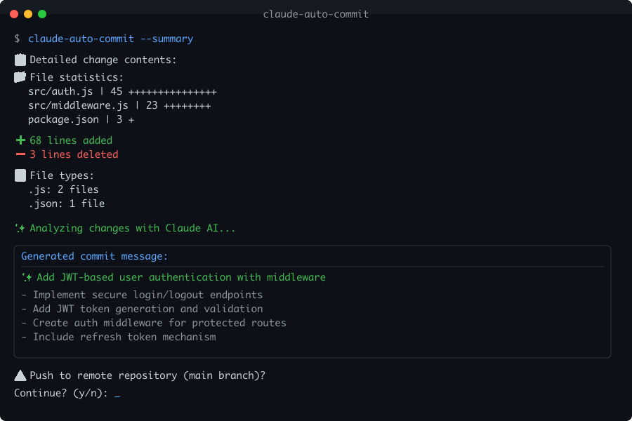

# Claude Auto-Commit Features

## Core Features

### 🧠 AI-Powered Commit Messages
Claude analyzes your code changes to generate meaningful commit messages that accurately describe what was changed and why.

### 🌍 Multi-Language Support
Currently supports:
- English (en)
- Japanese (ja) 
- Chinese (zh)
- Arabic (ar) - Coming soon
- Spanish (es) - Coming soon
- French (fr) - Coming soon

### 📝 Conventional Commits
Support for the [Conventional Commits](https://www.conventionalcommits.org/) specification:
```bash
claude-auto-commit -c -t feat
# Output: feat: add user authentication module
```

### 🔄 Auto-Update
Automatically checks for updates daily and self-updates when a new version is available.

## New Features (v0.0.3)

### 🔍 Dry Run Mode
Preview the generated commit message without actually committing:
```bash
claude-auto-commit --dry-run
```

### 📊 Change Summary
Get detailed statistics about your changes:
```bash
claude-auto-commit --summary

# Output:
# 📋 Detailed change contents:
#   📁 File statistics:
#     src/app.js    | 45 +++++++++++++++++++++++++++++++++++++--------
#     src/utils.js  | 12 ++++++------
#   
#   ➕ 51 lines added
#   ➖ 18 lines deleted
#   
#   📝 File types:
#     .js: 2 files
#     .md: 1 file
```

## Configuration Options

### Command Line Flags

| Flag | Description |
|------|-------------|
| `-b, --branch <branch>` | Target branch for push (default: main) |
| `-l, --language <lang>` | Commit message language |
| `-e, --emoji` | Use emoji in commit messages |
| `-n, --no-push` | Don't push after commit |
| `-s, --no-stage` | Manual file staging |
| `-d, --diff-lines <num>` | Max diff lines to analyze |
| `-m, --message <msg>` | Custom commit message |
| `-t, --type <type>` | Commit type (feat/fix/docs/etc) |
| `-v, --verbose` | Verbose output |
| `-c, --conventional` | Use Conventional Commits format |
| `-p, --prefix <prefix>` | Custom prefix (e.g., [WIP]) |
| `-y, --yes` | Skip push confirmation |
| `--dry-run` | Preview without committing |
| `--summary` | Show detailed change statistics |

### Configuration File

Create `~/.claude-auto-commit/config.yml`:

```yaml
auto_update:
  enabled: true
  frequency: daily  # daily/weekly/manual/always
  silent: false

defaults:
  language: en
  branch: main
  emoji: false
  conventional: false

git:
  auto_stage: true
  auto_push: true
```

## Usage Examples

### Basic Usage
```bash
# Simple commit with auto-generated message
claude-auto-commit

# Without pushing
claude-auto-commit -n
```

### Advanced Usage
```bash
# Dry run with summary in Japanese
claude-auto-commit --dry-run --summary -l ja

# Conventional commit for a new feature with emoji
claude-auto-commit -c -t feat -e

# Custom prefix with manual staging
claude-auto-commit -p "[HOTFIX]" -s

# Skip all confirmations for automation
claude-auto-commit -y
```

## Workflow Integration

### Git Aliases
Add to your `.gitconfig`:
```ini
[alias]
    ac = !claude-auto-commit
    acp = !claude-auto-commit -n
    acd = !claude-auto-commit --dry-run --summary
```

### Pre-commit Hook
Coming soon: Automatic message generation as a git hook.

## New Features (v0.0.4)

### 🧠 Commit History Learning
Analyze your project's commit history to maintain consistent style:
```bash
# Analyze last 100 commits
claude-auto-commit --analyze-history

# Output:
# 📊 Emoji usage: 76% (76/100 commits)
# 📏 Average message length: 52 characters
# 🏷️ Common prefixes: feat:, fix:, docs:
# 🌐 Detected languages: English 85%, Japanese 15%
```

### 🎯 Smart File Grouping
Intelligently categorize changed files:
```bash
claude-auto-commit --smart-group

# Output:
# File categories detected:
#   🎯 Frontend/Application: 3 files
#   🔧 Backend/API: 2 files
#   📖 Documentation: 1 file
```

### 📊 Learned Style Application
Apply analyzed patterns to new commits:
```bash
# Use learned commit style
claude-auto-commit --style learned
```

## New Features (v0.0.5) - Latest

### 📝 Template System
Save and reuse common commit message patterns:

<div align="center">



*Example of Claude Auto-Commit with detailed summary analysis*

</div>

```bash
# Save a template
claude-auto-commit --save-template hotfix "🔥 HOTFIX: {description}"
claude-auto-commit --save-template deps "⬆️ Update {package} from {old_version} to {new_version}"
claude-auto-commit --save-template wip "[WIP] {feature}: {status}"

# Use a template
claude-auto-commit --template hotfix
# Prompts: Enter value for description: [user input]
# Result: 🔥 HOTFIX: [user input]

# Short form
claude-auto-commit -T deps

# List all templates
claude-auto-commit --list-templates

# Delete a template
claude-auto-commit --delete-template wip
```

Templates support placeholders with `{variable}` syntax. When using a template with placeholders, you'll be prompted to enter values for each variable.

## Upcoming Features

- ✂️ **Split Commits**: Break large changes into logical commits
- 🔧 **Selective Analysis**: Filter files to include/exclude from analysis
- 🔗 **Git Hook Integration**: Automatic message generation on commit